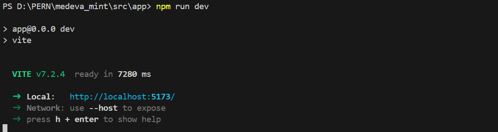
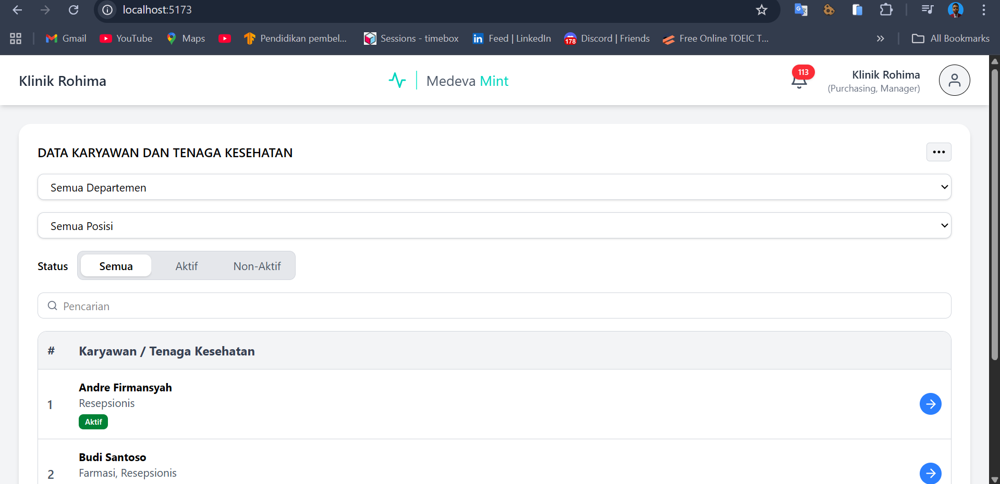

# Website Pengelolaan Data Karyawan

## a. Persiapan Database

Tambahkan database baru, berikut adalah command untuk postgress sheell:

```sql
CREATE DATABASE medeva_mint_db;
```

## b. Persiapan Backend Express.js

### 1. Instalasi seluruh paket

```shell
cd /src/api

npm init -y

npm install
```

### 2. Siapkan environment

Buat terlebih dahulu file .env.development dalam path medeva_mint/src/api yang berisi:

```
PORT=7007
JWT_SECRET=
JWT_TTL="1 day"
```

Perbarui juga password ataupun informasi dari database yang digunakan pada /config/db.config.js

### 3. Jalankan server

Ketika server backend express.js dijankan objek Sequilize akan menambahkan tabel ke database sebelumnya berdasarkan struktur pada objek yang ada.

```shell
npm run server
```


### 2. Lakukan Seed untuk Data Department dan Employee
Untuk memperoleh data awal atau default maka perlu untuk dilakukan seed data terlebih dahulu, yang dimulai dari data department.

```shell
node src/api/database/seeder/departments.seeder.js
```

Setelah data department berhasil ditambahkan, sesuaikan terlebih dahulu department id di seeder employee. Kemudian dilanjutkan untuk seed data employee dengan command berikut:

```
node src/api/database/seeder/employees.seeder.js
```

Dan jalankan kembali server seperti paeda langkah sebelumnya.

## c. Persiapan Frontend React.js

### 1. Instalasi seluruh paket

```shell
cd /src/app

npm install
```

### 2. Jalankan sistem frontend

```shell
npm run dev
```



Selanjutnya buka url yang diberikan http://localhost:5173/


